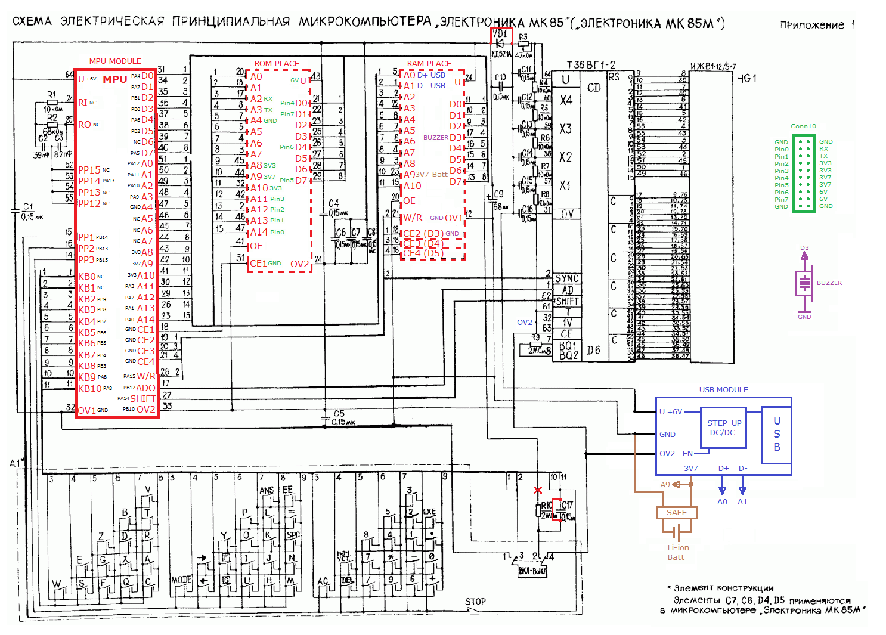

# MK85-Reload-
New Elektronika MK-85 files;

Файлы для модернизации калькулятора Электроника МК-85; 

Переделки обозначенные разными цветами могут производиться независимо друг от друга

Необходимые изменения на плате калькулятора

Разводка печатных плат выполнена в Sprint Layout 6;

 

Печатные платы толщиной 0,5мм;

Модуль MCU паяется на высоте 0,5мм от материнской платы;
К модулю USB необходимо припаять проводки, а затем производить монтаж;

Необходимо удалить ножку +6В на корпус калькулятора;

Аккумулятор Li-ion ёмкостью 250mAh (минимум) с платой защиты;

Идеально в устройство станет разьём microUSB, однако, я его считаю крайне неудачным и предпочитаю подпилить держатель, но установить miniUSB

**All.bin** содержит загрузчик и ПО; 

**System.bin** последняя прошивка v0002 (обновляется через загрузчик);

Если загружено не верное ПО, необходимо включить калькулятор, зажать любую цифровую клавишу и нажать RESET MPU для перезапуска загрузчика!
